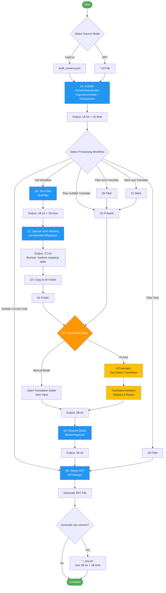
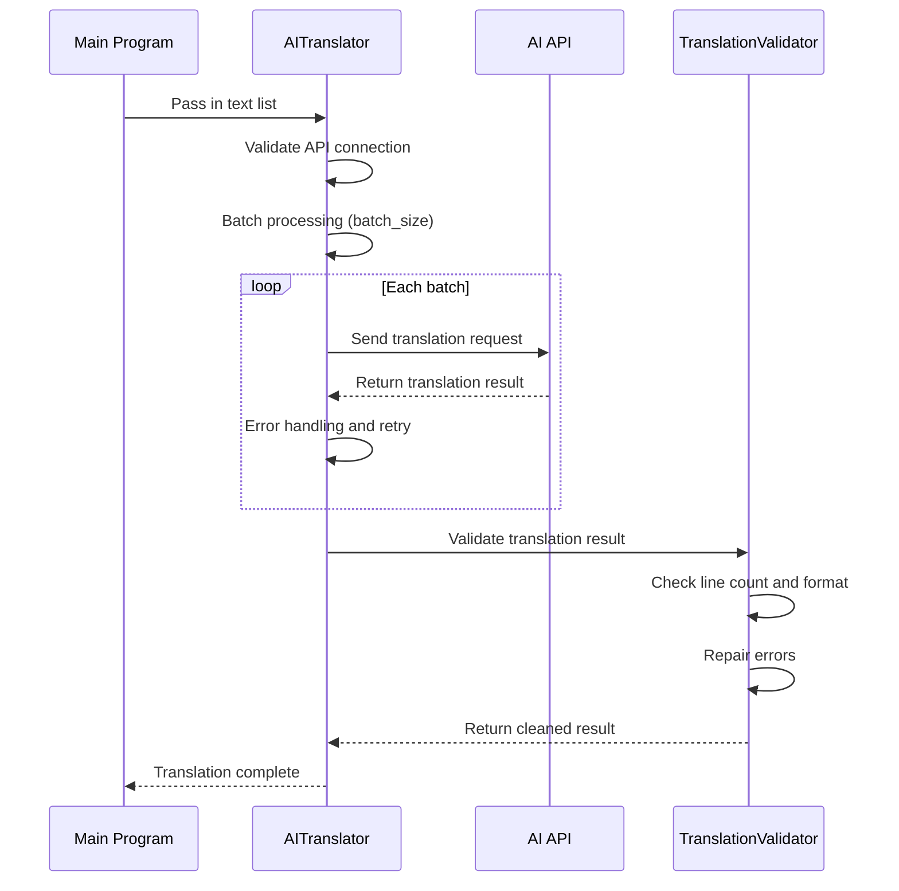
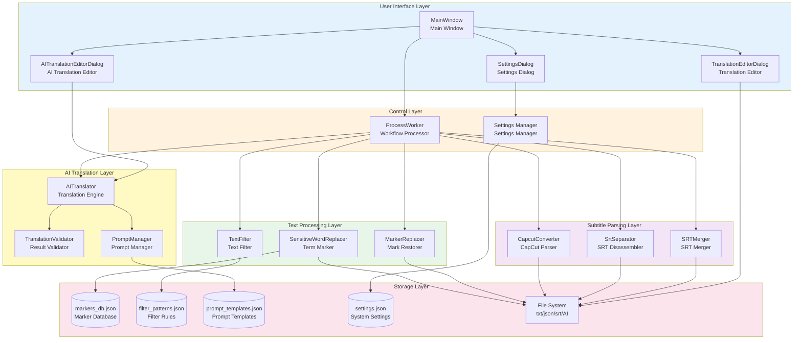
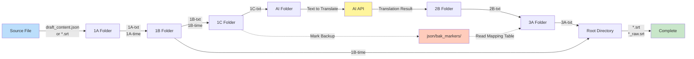

# Subtitle AI Translator

[](https://github.com/supkai0218/subtitle_AI_translator)
[](https://www.python.org/)
[](LICENSE)

An AI-powered automation tool designed for video subtitle translation, supporting both CapCut project format and standard SRT subtitle files.

---

## 📋 Table of Contents

- [Project Introduction](#project-introduction)
- [Purpose and Usage](#purpose-and-usage)
- [Architecture](#architecture)
- [Process Flow](#process-flow)
- [System Requirements](#system-requirements)
- [Installation](#installation)
- [Quick Start](#quick-start)

---

## 🎯 Project Introduction

**Subtitle AI Translator** is a professional video subtitle processing and translation tool that integrates an AI translation engine to automate the complete workflow from subtitle parsing, text filtering, and terminology protection to translation output.

### Core Features

- ✅ **Dual Format Support**: Supports CapCut project files (`draft_content.json`) and standard SRT subtitle format
- ✅ **AI Manual or Automatic Translation**: Manual translation is suitable for users utilizing free resources like immersive translation; automatic translation integrates multiple AI APIs (OpenRouter, OpenAI, Anthropic, etc.)
- ✅ **Flexible Processing Workflows**: Provides 6 different processing modes to meet various scenario needs
- ✅ **Terminology Protection**: Smart marking and restoration mechanism to ensure proper translation of proper nouns
- ✅ **Timecode Smart Correction**: Automatically adjusts overtime subtitle duration, suitable for Whisper speech-to-text scenarios
- ✅ **Batch Processing**: Supports folder batch processing and multi-file selection, with recursive subfolder processing
- ✅ **One-Click Full Automation**: Fully automated workflow with no manual intervention required
- ✅ **API Key Security**: Reads API keys from `.env` to prevent keys from being written into settings files
- ✅ **Multi-Language UI**: Supports Traditional Chinese and English UI switching
- ✅ **Real-Time AI Translation Monitoring**: Displays batch status, line counts, error codes, and overall progress in real time
- ✅ **Batch Failure Retry**: Automatically retries failed translation batches to improve success rate
- ✅ **Graphical Interface**: Intuitive PyQt6 GUI, easy to operate

---

## 📚 Purpose and Usage

### 2.1 Purpose

This system mainly solves the following problems:

1. **Video Subtitle Localization**: Quickly translate foreign subtitles into the target language
2. **Terminology Protection**: Protect specific terms from mistranslation during the translation process
3. **Batch Processing Needs**: Process multiple subtitle files at once to improve efficiency
4. **Translation Quality Control**: Built-in translation validation mechanism to ensure output quality

### 2.2 Main Functional Modules

| Module | Description |
|--------|-------------|
| **Subtitle Parsing** | Parse CapCut projects or disassemble SRT files, separating text and timecodes |
| **Text Filtering** | Filter out unwanted content based on custom rules (punctuation, symbols, etc.) |
| **Term Marking** | Mark special terms (person names, place names, proper nouns) to avoid mistranslation |
| **AI Translation** | Use AI API for batch translation, supporting multiple models |
| **Mark Restoration** | Restore marked terms after translation is complete |
| **SRT Generation** | Merge text and timecodes to generate the final SRT file |

### 2.3 Usage

#### Basic Operation Flow

```
1. Launch Main Program → 2. System Settings → 3. Select Source → 4. Select Workflow → 5. Execute Processing
```

#### Detailed Step-by-Step

**Step 1: System Settings**

First-time setup requires:
- API Key (required for AI translation, managed via `settings/.env`)
- Folder paths (default values can be used)
- Translation language settings (source language, target language)
- Prompt templates (optional)

Click the [System Settings] button on the main interface to configure. It is recommended to define `*_KEY` variables in `settings/.env` (e.g., `OPENROUTER_API_KEY=sk-...`), and the settings file will automatically reference them.

**Step 2: Select Source Mode**

- **CapCut Subtitle Parsing**: Suitable for CapCut editor exported project files
- **SRT File Disassembly**: Suitable for standard SRT subtitle files

**Step 3: Select Processing Workflow**

The system provides 6 workflow modes:

| Workflow Name | Applicable Scenario | Included Stages |
|---------|---------|----------|
| **Full Workflow** | Requires filtering, mark protection, and translation | 1A→1B→1C→1D→2C→3A→3B |
| **Subtitle Conversion Only** | Only format conversion needed | 1A→3B |
| **Raw Subtitle Translation** | Translate directly without filtering/marking | 1A→1D→2C→3B |
| **Filter Only (No Translation)** | Clean subtitles but do not translate | 1A→1B→3B |
| **Filter and Translate** | Translate after filtering (no mark protection) | 1A→1B→1D→2C→3B |
| **Mark and Translate** | Mark protection but no filtering | 1A→1C→1D→2C→3A→3B |

**Step 4: Select File and Set Output Filename**

- Click [Select Source File and Set Output Filename]
- Select the file to process
- Set the output filename (or use auto-generated name)

**Step 5: Execute Processing**

Click the [Start Processing] button. The system will:
- Display real-time processing progress
- Output log messages
- Automatically open the result folder

#### Three Operation Modes

##### 🔹 Mode 1: Standard Manual Mode

- Suitable for: Scenarios requiring manual review of translations
- Feature: Pauses at the translation stage, waiting for user confirmation or modification
- Operation: The system opens a translation editor window; you can manually input or use AI-assisted translation

##### 🔹 Mode 2: AI Automatic Translation Mode

- Suitable for: Scenarios where AI translation quality is trusted
- Feature: After enabling [Enable AI Automatic Translation], the translation stage completes automatically
- Operation: The system automatically calls the AI API for translation with no manual intervention required

##### 🔹 Mode 3: One-Click Full Automation Mode

- Suitable for: Batch processing of large numbers of files
- Feature: Check [One-Click Auto Mode (One-Click Auto)], and the entire workflow is fully automated
- Operation:
  1. Check [One-Click Auto Mode (One-Click Auto)]
  2. Select a single file or folder (batch processing)
  3. Optionally choose whether to [Include Subfolders]
  4. Click [Start Processing], and the system automatically processes all files

#### Batch Processing Feature

In **One-Click Full Automation Mode**, SRT mode supports batch processing:

```
1. Enable "One-Click Auto Mode"
2. Select "SRT File Disassembly"
3. Click Select File → Select "Folder (Batch Processing)"
4. Select the folder containing SRT files
5. The system automatically scans and processes all SRT files
```

Supports recursive subfolder processing, and a batch processing report is displayed upon completion.

#### Manual Tools

The system provides auxiliary tools for managing databases:

- **1B Filter Pattern Editor**: Edit filtering rules (text styles to remove)
- **2A Prompt Manager**: Manage AI translation Prompt templates
- **2B Marker Database Manager**: Manage special term marking lists
- **AI Translation Settings / Prompt**: Complete AI translation parameter configuration

---

## 🏗️ Architecture

### 3.1 Overall Architecture Diagram

```
Subtitle AI Translator
│
├── Main Program Layer (ai-translator-main.py)
│   ├── GUI Interface (PyQt6)
│   ├── Workflow Control Engine (ProcessWorker)
│   ├── Settings Management System (Settings Manager)
│   └── Batch Processing Controller
│
├── Core Module Layer (modules/)
│   ├── Subtitle Parsing Modules
│   │   ├── capcut_converter.py (CapCut Parser)
│   │   ├── srt_separator.py (SRT Disassembler)
│   │   └── srt_merger_v01.py (SRT Merger)
│   │
│   ├── Text Processing Modules
│   │   ├── text_filter.py (Text Filter v0.4 - with timecode correction)
│   │   ├── text_marker.py (Term Marker)
│   │   └── markreplacer.py (Mark Restorer)
│   │
│   ├── AI Translation Modules
│   │   ├── ai_translator.py (AI Translation Engine)
│   │   ├── ai_validator.py (Translation Validator)
│   │   └── prompt_manager.py (Prompt Manager)
│   │
│   ├── User Interface Modules
│   │   ├── translation_editor_dialog_v0.py (Manual Editor Dialog)
│   │   └── ai_translation_editor_dialog.py (AI Editor Dialog)
│   │
│   └── System Utility Modules
│       └── settings_path.py (Path Settings Management)
│
└── Auxiliary Tools Layer
    ├── 1B_filter_patterns_editor_v1.0.py (Filter Rule Editor)
    ├── 2A_prompt-manager_v0.1.py (Prompt Manager)
    └── 2B_markers-manager_v0.py (Marker Database Manager)
```

### 3.2 Main Program (ai-translator-main.py)

**Main Classes and Functions**:

| Class Name | Function Description |
|--------|---------|
| `MainWindow` | Main window interface, responsible for user interaction and UI control |
| `ProcessWorker` | Processing worker thread, executes the actual subtitle processing workflow |
| `SettingsDialog` | Settings dialog, manages system and AI parameters |
| `FilenameDialog` | Filename input dialog |

**Main Functional Modules**:

- **Settings Management**: Load/save settings file (JSON format)
- **Workflow Engine**: Execute corresponding processing stages based on the selected mode
- **GUI Control**: Progress bar, log display, button state management
- **Batch Processing**: Multi-file queue management, error tracking, report generation

### 3.3 Core Module Descriptions

#### Subtitle Parsing Modules

**capcut_converter.py**
- Function: Parse CapCut project `draft_content.json` file
- Output: 1A-txt (text) + 1A-time (timecodes)

**srt_separator.py**
- Function: Disassemble SRT subtitle files
- Output: 1A-txt (text) + 1A-time (timecodes)

**srt_merger_v01.py**
- Function: Merge text and timecodes to generate SRT files
- Input: txt file + time file
- Output: Standard SRT format file

#### Text Processing Modules

**text_filter.py** (v0.4)
- Function: Filter text based on rules (remove specific symbols, punctuation, etc.)
- Synchronously processes timecode files
- **New**: Timecode smart correction feature
  - Automatically detect overtime subtitles
  - Configurable max duration threshold and target duration
  - Precise time calculation to milliseconds
- Uses database: `filter_patterns.json`

**text_marker.py (SensitiveWordReplacer)**
- Function: Mark special terms (person names, place names, proper nouns)
- Replace with placeholders (e.g., `__MARK_001__`)
- Backup mark mapping table to `json/bak_markers/`
- Uses database: `markers_db.json`

**markreplacer.py (MarkerReplacer)**
- Function: Restore marked terms after translation
- Read backup mark mapping table
- Replace placeholders back to original terms

#### AI Translation Modules

**ai_translator.py (AITranslator)**
- Function: Communicate with AI API, execute batch translation
- Supports multiple API providers (OpenRouter, OpenAI, Anthropic, Custom)
- Concurrent processing, batch failure retry mechanism, error handling
- Real-time progress monitoring: displays batch status, line counts, and error codes in real time

**ai_validator.py (TranslationValidator)**
- Function: Validate completeness and format of translation results
- Check if line counts match
- Repair missing or incorrectly formatted translations
- Clean up extra quotes or marks

**prompt_manager.py (PromptManager)**
- Function: Manage Prompt templates
- Support variable substitution (source language, target language, etc.)
- Uses database: `prompt_templates.json`

### 3.4 Folder Structure

File flow during processing:

```
Project Root/
├── txt/
│   ├── 1A/        # Original disassembly (text + timecodes)
│   ├── 1B/        # After filtering (text + timecodes)
│   ├── 1C/        # After marking (text)
│   ├── 2B/        # Translation results (text)
│   └── 3A/        # After mark restoration (text)
├── AI/            # Transfer folder (for translation)
├── json/
│   ├── capcut/           # CapCut source files
│   ├── bak_markers/      # Mark backups
│   ├── markers_db.json   # Marker database
│   ├── filter_patterns.json  # Filter rules
│   └── prompt_templates.json # Prompt templates
├── srt/
│   └── in/        # SRT source files
├── settings/
│   ├── settings.json     # System settings file
│   └── .env              # API keys and environment variables
└── *.srt          # Output SRT files (default in root directory)
```

### 3.5 Auxiliary Tool Programs

**1B_filter_patterns_editor_v1.0.py**
- Function: Graphical filter rule editor
- Manages `filter_patterns.json`
- Provides rule testing functionality

**2A_prompt-manager_v0.1.py**
- Function: Manage AI Prompt templates
- Edit system prompt and user prompt template
- Manage `prompt_templates.json`

**2B_markers-manager_v0.py**
- Function: Manage special term marking lists
- Edit `markers_db.json`
- Add/delete/modify marked terms

---

## 🔄 Process Flow

### 4.1 Process Overview

The system adopts a modular stage-based processing workflow, where each stage is responsible for specific functionality:


### 4.2 Detailed Workflow Diagram



### 4.3 Detailed Stage Descriptions

#### Stage 1A: Subtitle Parse/Disassemble

**Function**: Convert source files into standardized text and timecode format

**Processing Modules**:
- CapCut mode: `capcut_converter.py`
- SRT mode: `srt_separator.py`

**Input**:
- CapCut: `draft_content.json`
- SRT: `*.srt`

**Output**:
- `1A-txt_{filename}.txt` - Pure text content (one subtitle per line)
- `1A-time_{filename}.txt` - Timecode information (SRT time format)

**Data Format Example**:

1A-txt file:
```
こんにちは
今日はいい天気ですね
```

1A-time file:
```
00:00:01,000 --> 00:00:03,000
00:00:03,500 --> 00:00:06,000
```

#### Stage 1B: Text Filtering and Timecode Correction

**Function**: Remove unwanted text content based on rules, synchronously process timecodes, and optionally correct overtime subtitles

**Processing Module**: `text_filter.py` (v0.4)

**Input**: `1A-txt` + `1A-time`

**Output**: `1B-txt` + `1B-time`

**Filter Rule Source**: `json/filter_patterns.json`

**Feature Highlights**:
- Remove blank lines
- Remove specific symbols/punctuation
- Synchronously adjust timecodes (remove corresponding time entries)
- Maintain consistent line count between text and timecode files
- **New (v0.89)**: Timecode smart correction
  - Automatically detect subtitle duration exceeding threshold
  - Adjust end time to target duration
  - Can be enabled/disabled and configured via GUI

**Timecode Correction Example**:

Settings: Max duration 5 seconds, correct to 3 seconds

Original timecodes:
```
1:00:00:10,000 --> 00:00:20,000  (duration 10 seconds)
2:00:00:10,000 --> 00:00:12,500  (duration 2.5 seconds)
```

Corrected timecodes:
```
1:00:00:10,000 --> 00:00:13,000  (adjusted to 3 seconds)
2:00:00:10,000 --> 00:00:12,500  (unchanged, under 5 seconds)
```

#### Stage 1C: Special Term Marking

**Function**: Mark special terms to prevent alteration during translation

**Processing Module**: `text_marker.py` (SensitiveWordReplacer)

**Input**: `1B-txt` or `1A-txt`

**Output**:
- `1C-txt_{filename}.txt` - Marked text
- `json/bak_markers/{filename}_markers.json` - Mark mapping table

**Marker Database**: `json/markers_db.json`

**Processing Example**:

Original text:
```
タナカさんは東京に行きます
```

After marking:
```
__MARK_001__さんは__MARK_002__に行きます
```

Mark mapping table:
```json
{
  "1": {"original": "タナカ", "marked": "__MARK_001__"},
  "2": {"original": "東京", "marked": "__MARK_002__"}
}
```

#### Stage 1D: Prepare Translation Files

**Function**: Copy files to be translated to the AI transfer folder

**Input**: `1C-txt`, `1B-txt`, or `1A-txt` (depending on workflow)

**Output**: Copied to `AI/` folder

**Behavior**:
- Clear the AI folder
- Copy source files
- Manual mode: Open folder for user to view
- Auto mode: Do not open folder

#### Stage 2C: AI Translation

**Function**: Translate text into the target language

**Processing Modules**:
- AI mode: `ai_translator.py` (AITranslator)
- Manual mode: `translation_editor_dialog_v0.py`

**Input**: Text files in the `AI/` folder

**Output**: `2B-txt_{filename}.txt`

**AI Translation Flow**:



**Supported API Providers**:
- OpenRouter
- OpenAI
- Anthropic (Claude)
- Custom (custom API endpoint)

**Translation Parameters**:
- `batch_size`: Number of lines per batch (default 10)
- `max_concurrent_requests`: Maximum concurrent requests (default 5)
- `max_retries`: Maximum retry count (default 3)
- `batch_failed_retry_count`: Batch failure retry count (default 3)
- `enable_validation`: Enable result validation (default enabled)

#### Stage 3A: Mark Restoration

**Function**: Restore mark placeholders in translated text back to original terms

**Processing Module**: `markreplacer.py` (MarkerReplacer)

**Input**:
- `2B-txt_{filename}.txt` - Translation result
- `json/bak_markers/{filename}_markers.json` - Mark mapping table

**Output**: `3A-txt_{filename}.txt`

**Restoration Example**:

After translation (2B):
```
__MARK_001__ 先生將前往 __MARK_002__
```

After restoration (3A):
```
田中 先生將前往 東京
```

#### Stage 3B: Generate SRT File

**Function**: Merge text and timecodes to generate the final SRT subtitle file

**Processing Module**: `srt_merger_v01.py` (SRTMerger)

**Input**:
- Text file: `3A-txt`, `2B-txt`, `1B-txt`, or `1A-txt` (depending on workflow)
- Timecode file: `1B-time` or `1A-time` (depending on workflow)

**Output**:
- `{filename}.srt` - Main translated subtitles
- `{filename}_raw.srt` - Original subtitles (conditionally generated)

**SRT Format Example**:

```srt
1
00:00:01,000 --> 00:00:03,000
Hello

2
00:00:03,500 --> 00:00:06,000
The weather is really nice today
```

**Conditional raw version generation**:
- If stage 1B (filtering) was executed and the raw subtitle generation option is enabled, then generate `*_raw.srt`
- Use `1B-txt` + `1B-time` to generate the original subtitle for reference
- The suffix name can be customized (default: `_raw`)

### 4.4 Module Interaction Diagram



### 4.5 Data Flow Diagram



### 4.6 Six Workflow Mode Comparison Table

| Workflow Mode | Stage Sequence | Text Path | Timecode Path | Applicable Scenario |
|---------|---------|----------|-----------|----------|
| **Full Workflow** | 1A→1B→1C→1D→2C→3A→3B | 1A→1B→1C→2B→3A | 1A→1B | Requires complete filtering, mark protection, and translation |
| **Subtitle Conversion Only** | 1A→3B | 1A | 1A | Only format conversion needed, no translation |
| **Raw Subtitle Translation** | 1A→1D→2C→3B | 1A→2B | 1A | Direct translation, no filtering or marking |
| **Filter Only (No Translation)** | 1A→1B→3B | 1A→1B | 1A→1B | Clean subtitles but do not translate |
| **Filter and Translate** | 1A→1B→1D→2C→3B | 1A→1B→2B | 1A→1B | Translate after filtering (no mark protection) |
| **Mark and Translate** | 1A→1C→1D→2C→3A→3B | 1A→1C→2B→3A | 1A | Mark protection but no filtering |

### 4.7 Key Design Features

#### 🔹 Timecode Synchronization Mechanism

In the 1B filtering stage, when a text line is removed, the corresponding timecode line is also removed, ensuring:
- The text file and timecode file always have the same number of lines
- The final generated SRT file has correctly matched timecodes

#### 🔹 Mark Protection Mechanism

The 1C stage replaces special terms with placeholders (`__MARK_XXX__`), ensuring:
- AI translation does not mistranslate proper nouns
- The 3A stage restores the original terms
- Supports terminology protection across languages

#### 🔹 Batch Processing and Error Isolation

In batch mode:
- A single file failure does not affect other files
- Records error information for each file
- Generates a complete batch processing report

#### 🔹 AI Translation Optimization

- **Batch Processing**: Reduces the number of API calls
- **Concurrent Requests**: Increases processing speed
- **Auto Retry**: Handles network instability
- **Result Validation**: Ensures translation completeness

---

## 💻 System Requirements

- **Operating System**: Windows / macOS / Linux
- **Python Version**: 3.8 or higher
- **Required Packages**:
  - PyQt6
  - requests (for AI API calls)
  - Other dependencies (see requirements.txt)

---

## 📦 Installation

### Method 1: Install from Source

```bash
# Clone the project
git clone https://github.com/supkai0218/subtitle_AI_translator.git
cd subtitle_AI_translator

# Install dependencies
pip install -r requirements.txt

# Run the main program
python ai-translator-main.py
```

### Method 2: Executable Version

If a packaged executable (.exe) is provided, simply run it directly.

---

## 🚀 Quick Start

### Simplest Usage Example: One-Click Automatic Translation

1. Launch the program, click [System Settings]
2. Fill in the API key in the "AI Translation Settings" tab
3. Close the settings window
4. Check [One-Click Auto Mode (One-Click Auto)]
5. Select [SRT File Disassembly] mode
6. Click [Select Source File...] → Select [Folder (Batch Processing)]
7. Select the folder containing SRT files
8. Select [Full Workflow]
9. Click [Start Processing]
10. Wait for processing to complete; the system will automatically open the result folder

Done! All files have been automatically translated.

---

## 📝 Settings File Description

The main settings file is located at `settings/settings.json`, containing:

- **paths**: Folder paths for each processing stage
- **ai_translation**: AI API settings and parameters
  - `api_provider`: API provider (openrouter / openai / anthropic / custom)
  - `api_key`: API key (referenced as `${VAR_NAME}` from .env variables)
  - `model`: AI model to use
  - `source_language`: Source language
  - `target_language`: Target language
  - `batch_size`: Number of lines per batch
  - `max_concurrent_requests`: Maximum concurrent requests
  - `batch_failed_retry_count`: Batch failure retry count
  - `prompts`: System and user prompts
- **text_filter**: Text filtering and timecode correction settings
  - `timecode_correction_enabled`: Whether to enable timecode correction
  - `timecode_max_duration`: Max duration threshold (seconds)
  - `timecode_target_duration`: Target duration for correction (seconds)
- **raw_subtitle**: Raw subtitle generation settings
  - `enabled`: Whether to generate raw subtitles
  - `suffix`: Raw subtitle suffix name
- **language**: UI language settings
  - `interface_language`: Interface language (zh-TW / en)

### API Key Management

API keys are managed through the `.env` file to avoid plaintext storage in settings files:

- Define `*_KEY` variables in `settings/.env` (e.g., `OPENROUTER_API_KEY=sk-...`)
- Reference in settings file as `${OPENROUTER_API_KEY}`
- You can also select "Custom" in the settings dialog to directly input the key; the system will automatically save it to `MAIN_API_KEY` in `.env`

---

## ❓ FAQ

### Q1: Which languages are supported for translation?

A: Theoretically supports all languages that the AI model can process. Common combinations:
- Japanese → Traditional Chinese
- English → Traditional Chinese
- Korean → Traditional Chinese

### Q2: Does AI translation cost money?

A: Yes, you need to use an AI API service (such as OpenRouter, OpenAI), which incurs API usage fees. The specific cost depends on the model used.

### Q3: Can it be used offline?

A: Some functions can be used offline (subtitle parsing, text filtering, SRT conversion), but the AI translation function requires a network connection.

### Q4: What is the difference between "Full Workflow" and "Raw Subtitle Translation"?

A:
- **Full Workflow**: Includes filtering (removing noise) and marking (protecting proper nouns), suitable for scenarios requiring high-quality translation
- **Raw Subtitle Translation**: Translates the original text directly without any preprocessing, faster speed

### Q5: How do I add marked terms?

A: Click the [2B Marker Database Manager] button on the main interface to open the manager and add terms.

### Q6: What if batch processing fails?

A: The system records failed files and continues processing other files. After completion, a batch processing report is displayed, listing all failed files and reasons.

### Q7: What if I'm not satisfied with the translation results?

A: You can:
1. Adjust the Prompt template (click the [AI Translation Settings / Prompt] button)
2. Switch to a different AI model
3. Use manual translation mode for human proofreading

---

## 🔧 Advanced Usage

### Custom Prompt Templates

You can customize in [AI Translation Settings / Prompt]:

**System Prompt Example**:
```
You are a professional video subtitle translation expert, skilled at translating Japanese subtitles into natural and fluent Traditional Chinese.
```

**User Prompt Template Example**:
```
Please translate the following Japanese subtitles into Traditional Chinese, preserving the original meaning and conforming to Taiwanese usage habits:

{text}

Please return the translation result directly, with each line corresponding to one sentence.
```

### Filter Rule Editing

Use the [1B Filter Pattern Management] tool to edit `filter_patterns.json`:

```json
{
  "patterns": [
    {"type": "exact", "value": "♪"},
    {"type": "regex", "value": "\\(.*?\\)"},
    {"type": "startswith", "value": "#"}
  ]
}
```

---

## 📄 License

This project is licensed under the MIT License, see the [LICENSE](LICENSE) file for details.

---

## 🤝 Contributing

Issues and Pull Requests are welcome!

---

## 📧 Contact

If you have any questions or suggestions, please contact us via [GitHub Issues](https://github.com/supkai0218/subtitle_AI_translator/issues).

---

## 🎉 Acknowledgments

Thanks to all users for their feedback and suggestions!

---

**Last Updated**: 2026-06-02 (v0.89.11)

---

## 📜 Version History

### v0.89.11 (2026-06)
- 🔐 One-click translation adds API key dropdown, reads `*_KEY` variables from .env
- ✏️ Provides custom input field; key is saved to `MAIN_API_KEY` to avoid plaintext in settings.json

### v0.89.10 (2026-06)
- ☑️ One-click translation adds multi-file selection mode, supports batch processing of multiple SRT files
- 🔧 Fix unable to read environment variable API key in one-click translation

### v0.89.09 (2026-06)
- 🤖 After AI translator debugging is complete, settings can be written to one-click translation settings

### v0.89.08 (2026-06)
- 📊 Enhanced real-time AI translation progress monitoring
- 📈 Real-time display of each batch's status, line count, error codes, and overall progress

### v0.89.07 (2026-06)
- 📄 AI editor separates settings files into `AI_prompt.json` and `AI_config.json`
- 🔧 Optimize API provider and model management logic

### v0.89.06 (2026-06)
- 🏷️ Added default naming logic: CapCut uses parent folder name, SRT uses `filename_ai`

### v0.89.05 (2026-06)
- 🔁 Added batch translation failure retry mechanism
- ⚖️ Adjust blank translation threshold
- 📛 Removed version number from main filename

### v0.89.04 (2026-06)
- 🔧 Added environment variable substitution; settings files can use `${VAR_NAME}` to reference environment variables

### v0.89.03 (2026-06)
- 🎵 Added audio separation standalone tool
- 📂 Other standalone tool path and filename changes

### v0.89.02 (2026-06)
- 🌏 Added interface language pack switching (Traditional Chinese / English)

### v0.89.01 (2026-06)
- 🔤 Added custom suffix filename feature for raw subtitles in 3B workflow

### v0.89.00 (2026-01-20)
- ✨ Added 1B timecode filtering and correction feature
- 🎛️ GUI integrates timecode correction parameter settings
- ⚙️ settings.json adds `text_filter` settings section
- 🔄 Upgrade `text_filter` module to v0.4
- 📝 Complete technical documentation and usage instructions

### v0.88.06 (2026-01)
- 🔧 Fix one-click auto execution mode issue
- 🔒 Window size lock to prevent enlargement
- 📂 Fix folder opening logic
- 🗂️ Subfolder recursive processing option
