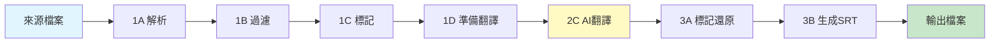
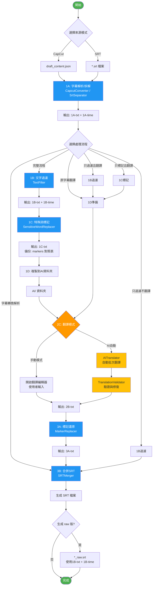
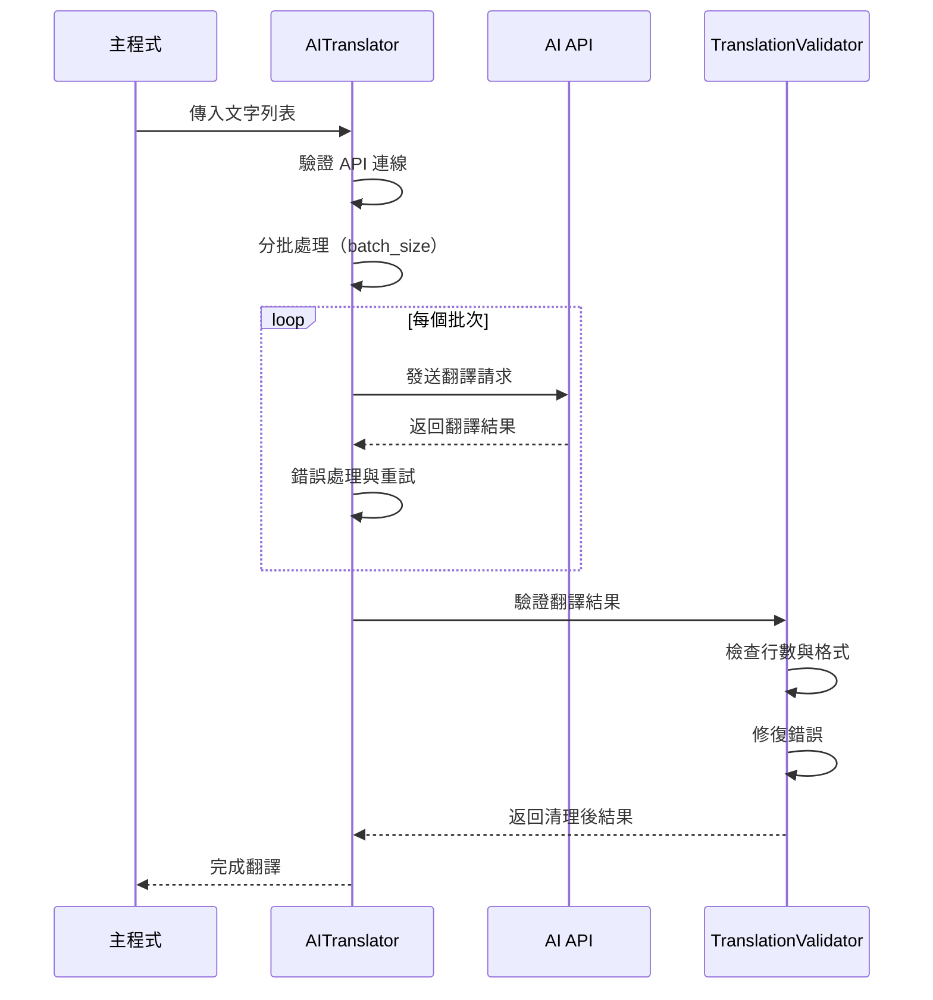
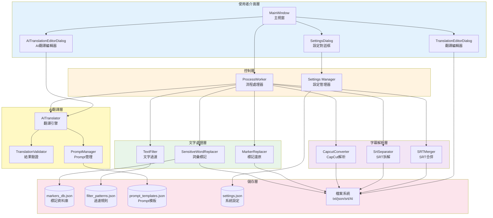
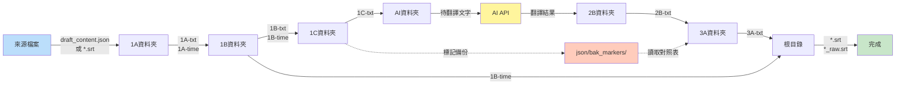

# 字幕AI翻譯系統 (Subtitle AI Translator)

[](https://github.com/supkai0218/subtitle_AI_translator)
[](https://www.python.org/)
[](LICENSE)

專為影片字幕翻譯設計的AI自動化工具，支援CapCut專案格式與SRT字幕檔案。

---

## 📋 目錄

- [專案簡介](#專案簡介)
- [程式使用目的及使用方法](#程式使用目的及使用方法)
- [主程式與附屬程式架構](#主程式與附屬程式架構)
- [程式流程與相關性說明](#程式流程與相關性說明)
- [系統需求](#系統需求)
- [安裝說明](#安裝說明)
- [快速開始](#快速開始)

---

## 🎯 專案簡介

**字幕AI翻譯系統** 是一個專業的影片字幕處理與翻譯工具，整合了AI翻譯引擎，能夠自動化處理從字幕解析、文字過濾、特殊詞彙保護到翻譯輸出的完整流程。

### 核心特色

- ✅ **雙格式支援**：支援 CapCut 專案檔案（draft_content.json）與標準 SRT 字幕格式
- ✅ **AI 手動或自動翻譯**：手動翻譯適用於使用沉浸式翻譯等免費資源的使用者，自動翻譯則整合多種 AI API（OpenRouter、OpenAI、Anthropic 等）
- ✅ **彈性處理流程**：提供 6 種不同的處理模式，滿足各種需求場景
- ✅ **特殊詞彙保護**：智慧標記與還原機制，確保專有名詞正確翻譯
- ✅ **時間碼智慧修正**：自動調整超時字幕的時間長度（v0.89 新增）-->適用於使用Whisper進行語音轉錄時的問題
- ✅ **批次處理**：支援資料夾批次處理，可遞迴處理子資料夾
- ✅ **一鍵全自動**：自動化完整流程，無需手動干預
- ✅ **圖形化介面**：直覺的 PyQt6 GUI，易於操作

### 🆕 v0.89.00 更新重點 (2026-01-20)

#### 1B 時間碼過濾及修正功能

本版本在 1B 文字過濾階段新增**時間碼智慧修正功能**，可自動調整超時字幕的時間長度：

- ⏱️ **自動偵測超時字幕**：系統自動計算每個字幕的時間差（結束時間 - 起始時間）
- ✂️ **智慧修正長度**：當時間差超過設定閾值時，自動調整為目標時長
- 🎛️ **參數可調**：提供 GUI 介面讓使用者自訂閾值（最大時長）和目標時長
- 💾 **設定持久化**：參數自動儲存至 settings.json，下次使用保持設定
- ⚙️ **精確計算**：以毫秒為單位進行時間計算，確保精度
- 🛡️ **向後相容**：未啟用時行為與舊版完全相同

**適用場景**：
- 字幕顯示時間過長，需要統一調整
- 批次處理大量字幕檔案，確保時長一致性
- 影片剪輯後需要調整字幕時長配合節奏

**使用方式**：
1. 選擇包含 1B 步驟的流程（如：完整流程、只過濾不翻譯、只過濾且翻譯）
2. 在「流程預覽」中找到「1B: 文字過濾」
3. 勾選「☑ 啟用時間碼修正」
4. 設定「最大時長(秒)」（預設 5.0）和「修正為(秒)」（預設 3.0）
5. 執行流程，系統會自動修正超時字幕

**範例**：
- 設定最大時長 5 秒，修正為 3 秒
- 原始時間碼：`00:00:10,000 --> 00:00:20,000`（10 秒，超過 5 秒）
- 修正後：`00:00:10,000 --> 00:00:13,000`（調整為 3 秒）

**技術更新**：
- 新增 [`modules/text_filter.py`](modules/text_filter.py:1) v0.4（升級自 text_filter_v01.py）
- 主程式升級至 [`ai-translator-main-v0.89.py`](ai-translator-main-v0.89.py:1)
- settings.json 新增 `text_filter` 設定區塊

詳細技術文件請參考：[`plans/1B_timecode_implementation_summary.md`](plans/1B_timecode_implementation_summary.md:1)

---

## 📚 程式使用目的及使用方法

### 2.1 使用目的

本系統主要解決以下問題：

1. **影片字幕本地化**：快速將外語字幕翻譯成目標語言
2. **專業術語保護**：在翻譯過程中保護特定詞彙不被誤譯
3. **批量處理需求**：一次處理多個字幕檔案，提高效率
4. **翻譯品質控管**：內建翻譯驗證機制，確保輸出品質

### 2.2 主要功能模組

| 功能模組 | 說明 |
|---------|------|
| **字幕解析** | 解析 CapCut 專案或拆解 SRT 檔案，分離文字與時間軸 |
| **文字過濾** | 根據自訂規則過濾不需要的內容（標點、符號等） |
| **詞彙標記** | 標記特殊詞彙（人名、地名、專有名詞）避免誤譯 |
| **AI 翻譯** | 使用 AI API 進行批次翻譯，支援多種模型 |
| **標記還原** | 翻譯完成後還原被標記的詞彙 |
| **SRT 生成** | 合併文字與時間軸，生成最終 SRT 檔案 |

### 2.3 使用方法

#### 基本操作流程

```
1. 開啟主程式 → 2. 系統設定 → 3. 選擇來源 → 4. 選擇流程 → 5. 執行處理
```

#### 詳細步驟說明

**步驟 1：系統設定**

首次使用需要配置：
- API 金鑰（AI 翻譯功能需要）
- 資料夾路徑（可使用預設值）
- 翻譯語言設定（來源語言、目標語言）
- Prompt 模板（可選）

點擊主介面的【系統設定】按鈕進行配置。

**步驟 2：選擇來源模式**

- **CapCut 字幕解析**：適用於 CapCut 編輯器匯出的專案檔案
- **SRT 檔案拆解**：適用於標準 SRT 字幕檔案

**步驟 3：選擇處理流程**

系統提供 6 種流程模式：

| 流程名稱 | 適用場景 | 包含階段 |
|---------|---------|----------|
| **完整流程** | 需要過濾、標記保護與翻譯 | 1A→1B→1C→1D→2C→3A→3B |
| **字幕轉換解析** | 僅需要格式轉換 | 1A→3B |
| **原字幕翻譯** | 不需過濾和標記，直接翻譯 | 1A→1D→2C→3B |
| **只過濾不翻譯** | 清理字幕但不翻譯 | 1A→1B→3B |
| **只過濾且翻譯** | 過濾後翻譯（無標記保護） | 1A→1B→1D→2C→3B |
| **只標記且翻譯** | 標記保護但不過濾 | 1A→1C→1D→2C→3A→3B |

**步驟 4：選擇檔案並設定輸出檔名**

- 點擊【選擇來源檔案並設定輸出檔名】
- 選擇要處理的檔案
- 設定輸出檔名（或使用自動產生）

**步驟 5：執行處理**

點擊【開始執行】按鈕，系統會：
- 顯示即時處理進度
- 輸出日誌訊息
- 自動開啟結果資料夾

#### 三種工作模式

##### 🔹 模式 1：標準手動模式

- 適合：需要人工審閱翻譯的場景
- 特點：在翻譯階段會暫停，等待使用者確認或修改
- 操作：系統會開啟翻譯編輯視窗，可手動輸入或使用 AI 輔助翻譯

##### 🔹 模式 2：AI 自動翻譯模式

- 適合：信任 AI 翻譯品質的場景
- 特點：啟用【啟用 AI 自動翻譯】選項後，翻譯階段自動完成
- 操作：系統自動呼叫 AI API 進行翻譯，無需手動干預

##### 🔹 模式 3：一鍵全自動模式

- 適合：批次處理大量檔案
- 特點：勾選【一鍵全自動模式】，整個流程完全自動化
- 操作：
  1. 勾選【一鍵全自動模式 (One-Click Auto)】
  2. 選擇單一檔案或資料夾（批次處理）
  3. 可選擇是否【包含子資料夾】
  4. 點擊【開始執行】，系統自動處理所有檔案

#### 批次處理功能

在**一鍵全自動模式**下，SRT 模式支援批次處理：

```
1. 啟用「一鍵全自動模式」
2. 選擇「SRT 檔案拆解」
3. 點擊選擇檔案 → 選擇「資料夾（批次處理）」
4. 選擇包含 SRT 檔案的資料夾
5. 系統自動掃描並處理所有 SRT 檔案
```

支援遞迴處理子資料夾，完成後會顯示批次處理報告。

#### 手動工具

系統提供輔助工具用於管理資料庫：

- **1B 過濾文字管理**：編輯過濾規則（要移除的文字樣式）
- **2A prompt 管理**：管理 AI 翻譯的 Prompt 模板
- **2B 標記資料庫管理**：管理特殊詞彙標記清單
- **AI 翻譯設定 / Prompt**：完整的 AI 翻譯參數配置

---

## 🏗️ 主程式與附屬程式架構

### 3.1 整體架構圖

```
字幕AI翻譯系統
│
├── 主程式層 (ai-translator-main-v0.89.py)
│   ├── GUI 介面 (PyQt6)
│   ├── 流程控制引擎 (ProcessWorker)
│   ├── 設定管理系統 (Settings Manager)
│   └── 批次處理控制器
│
├── 核心模組層 (modules/)
│   ├── 字幕解析模組
│   │   ├── capcut_converter.py (CapCut 解析器)
│   │   ├── srt_separator.py (SRT 拆解器)
│   │   └── srt_merger_v01.py (SRT 合併器)
│   │
│   ├── 文字處理模組
│   │   ├── text_filter.py (文字過濾器 v0.4 - 含時間碼修正)
│   │   ├── text_marker.py (特殊詞標記器)
│   │   └── markreplacer.py (標記還原器)
│   │
│   ├── AI 翻譯模組
│   │   ├── ai_translator.py (AI 翻譯引擎)
│   │   ├── ai_validator.py (翻譯驗證器)
│   │   └── prompt_manager.py (Prompt 管理器)
│   │
│   ├── 使用者介面模組
│   │   ├── translation_editor_dialog_v0.py (手動編輯對話框)
│   │   └── ai_translation_editor_dialog.py (AI 編輯對話框)
│   │
│   └── 系統工具模組
│       └── settings_path.py (路徑設定管理)
│
└── 輔助工具層
    ├── 1B_filter_patterns_editor_v1.0.py (過濾規則編輯器)
    ├── 2A_prompt-manager_v0.1.py (Prompt 管理器)
    └── 2B_markers-manager_v0.py (標記資料庫管理器)
```

### 3.2 主程式 (ai-translator-main-v0.89.py)

**主要類別與功能**：

| 類別名稱 | 功能說明 |
|---------|---------|
| `MainWindow` | 主視窗介面，負責使用者互動與介面控制 |
| `ProcessWorker` | 處理執行緒，執行實際的字幕處理流程 |
| `SettingsDialog` | 設定對話框，管理系統與 AI 參數 |
| `FilenameDialog` | 檔名輸入對話框 |

**主要功能模組**：

- **設定管理**：載入/儲存設定檔（JSON 格式）
- **流程引擎**：根據選擇的模式執行對應的處理階段
- **GUI 控制**：進度條、日誌顯示、按鈕狀態管理
- **批次處理**：多檔案佇列管理、錯誤追蹤、報告生成

### 3.3 核心模組說明

#### 字幕解析模組

**capcut_converter.py**
- 功能：解析 CapCut 專案的 draft_content.json 檔案
- 輸出：1A-txt（文字）+ 1A-time（時間軸）

**srt_separator.py**
- 功能：拆解 SRT 字幕檔案
- 輸出：1A-txt（文字）+ 1A-time（時間軸）

**srt_merger_v01.py**
- 功能：合併文字與時間軸，生成 SRT 檔案
- 輸入：txt 檔案 + time 檔案
- 輸出：標準 SRT 格式檔案

#### 文字處理模組

**text_filter.py** (v0.4)
- 功能：根據規則過濾文字（移除特定符號、標點等）
- 同步處理時間軸檔案
- **新增**：時間碼智慧修正功能
  - 自動偵測超時字幕
  - 可設定最大時長閾值和目標時長
  - 精確到毫秒的時間計算
- 使用資料庫：filter_patterns.json

**text_marker.py (SensitiveWordReplacer)**
- 功能：標記特殊詞彙（人名、地名、專有名詞）
- 替換為占位符（如 `__MARK_001__`）
- 備份標記對照表到 json/bak_markers/
- 使用資料庫：markers_db.json

**markreplacer.py (MarkerReplacer)**
- 功能：還原翻譯後的標記詞彙
- 讀取備份的標記對照表
- 將占位符替換回原始詞彙

#### AI 翻譯模組

**ai_translator.py (AITranslator)**
- 功能：與 AI API 通訊，執行批次翻譯
- 支援多種 API 供應商（OpenRouter、OpenAI、Anthropic、Custom）
- 並行處理、重試機制、錯誤處理

**ai_validator.py (TranslationValidator)**
- 功能：驗證翻譯結果的完整性與格式
- 檢查行數是否匹配
- 修復缺失或格式錯誤的翻譯
- 清理多餘的引號或標記

**prompt_manager.py (PromptManager)**
- 功能：管理 Prompt 模板
- 支援變數替換（來源語言、目標語言等）
- 使用資料庫：prompt_templates.json

### 3.4 資料夾結構

處理過程中的檔案流向：

```
專案根目錄/
├── txt/
│   ├── 1A/        # 原始拆解（文字+時間軸）
│   ├── 1B/        # 過濾後（文字+時間軸）
│   ├── 1C/        # 標記後（文字）
│   ├── 2B/        # 翻譯結果（文字）
│   └── 3A/        # 標記還原後（文字）
├── AI/            # 中轉資料夾（翻譯用）
├── json/
│   ├── capcut/           # CapCut 來源檔案
│   ├── bak_markers/      # 標記備份
│   ├── markers_db.json   # 標記資料庫
│   ├── filter_patterns.json  # 過濾規則
│   └── prompt_templates.json # Prompt 模板
├── srt/
│   └── in/        # SRT 來源檔案
├── settings/
│   └── settings.json     # 系統設定檔
└── *.srt          # 輸出的 SRT 檔案（預設在根目錄）
```

### 3.5 輔助工具程式

**1B_filter_patterns_editor_v1.0.py**
- 功能：圖形化編輯過濾規則
- 管理 filter_patterns.json
- 提供規則測試功能

**2A_prompt-manager_v0.1.py**
- 功能：管理 AI Prompt 模板
- 編輯 system prompt 和 user prompt template
- 管理 prompt_templates.json

**2B_markers-manager_v0.py**
- 功能：管理特殊詞彙標記清單
- 編輯 markers_db.json
- 新增/刪除/修改標記詞彙

---

## 🔄 程式流程與相關性說明

### 4.1 處理流程總覽

系統採用模組化的階段式處理流程，每個階段負責特定功能：



### 4.2 完整流程詳細圖



### 4.3 各階段詳細說明

#### 階段 1A：字幕解析/拆解

**功能**：將來源檔案轉換為標準化的文字與時間軸格式

**處理模組**：
- CapCut 模式：`capcut_converter.py`
- SRT 模式：`srt_separator.py`

**輸入**：
- CapCut: `draft_content.json`
- SRT: `*.srt`

**輸出**：
- `1A-txt_{filename}.txt` - 純文字內容（每行一句字幕）
- `1A-time_{filename}.txt` - 時間軸資訊（SRT 時間格式）

**資料格式範例**：

1A-txt 檔案：
```
こんにちは
今日はいい天気ですね
```

1A-time 檔案：
```
00:00:01,000 --> 00:00:03,000
00:00:03,500 --> 00:00:06,000
```

#### 階段 1B：文字過濾與時間碼修正

**功能**：根據規則移除不需要的文字內容，同步處理時間軸，並可選擇性修正超時字幕

**處理模組**：`text_filter.py` (v0.4)

**輸入**：`1A-txt` + `1A-time`

**輸出**：`1B-txt` + `1B-time`

**過濾規則來源**：`json/filter_patterns.json`

**功能特點**：
- 移除空白行
- 移除特定符號/標點
- 同步調整時間軸（刪除對應的時間項）
- 保持文字與時間軸行數一致
- **新增 (v0.89)**：時間碼智慧修正
  - 自動偵測超過閾值的字幕時長
  - 調整結束時間為目標時長
  - 可在 GUI 中啟用/停用及設定參數

**時間碼修正範例**：

設定：最大時長 5 秒，修正為 3 秒

原始時間碼：
```
1:00:00:10,000 --> 00:00:20,000  （時長 10 秒）
2:00:00:10,000 --> 00:00:12,500  （時長 2.5 秒）
```

修正後時間碼：
```
1:00:00:10,000 --> 00:00:13,000  （調整為 3 秒）
2:00:00:10,000 --> 00:00:12,500  （不變，因未超過 5 秒）
```

#### 階段 1C：特殊詞標記

**功能**：標記特殊詞彙以防止翻譯時被改變

**處理模組**：`text_marker.py` (SensitiveWordReplacer)

**輸入**：`1B-txt` 或 `1A-txt`

**輸出**：
- `1C-txt_{filename}.txt` - 標記後的文字
- `json/bak_markers/{filename}_markers.json` - 標記對照表

**標記資料庫**：`json/markers_db.json`

**處理範例**：

原文：
```
タナカさんは東京に行きます
```

標記後：
```
__MARK_001__さんは__MARK_002__に行きます
```

標記對照表：
```json
{
  "1": {"original": "タナカ", "marked": "__MARK_001__"},
  "2": {"original": "東京", "marked": "__MARK_002__"}
}
```

#### 階段 1D：準備翻譯檔案

**功能**：將待翻譯檔案複製到 AI 中轉資料夾

**輸入**：`1C-txt`、`1B-txt` 或 `1A-txt`（依流程而定）

**輸出**：複製到 `AI/` 資料夾

**行為**：
- 清空 AI 資料夾
- 複製來源檔案
- 手動模式：開啟資料夾供使用者查看
- 自動模式：不開啟資料夾

#### 階段 2C：AI 翻譯

**功能**：將文字翻譯為目標語言

**處理模組**：
- AI 模式：`ai_translator.py` (AITranslator)
- 手動模式：`translation_editor_dialog_v0.py`

**輸入**：`AI/` 資料夾中的文字檔案

**輸出**：`2B-txt_{filename}.txt`

**AI 翻譯流程**：



**支援的 API 供應商**：
- OpenRouter
- OpenAI
- Anthropic (Claude)
- Custom（自訂 API endpoint）

**翻譯參數**：
- `batch_size`：每批次處理行數（預設 10）
- `max_concurrent_requests`：最大並行請求數（預設 5）
- `max_retries`：最大重試次數（預設 3）
- `enable_validation`：啟用結果驗證（預設啟用）

#### 階段 3A：標記還原

**功能**：將翻譯後的標記占位符還原為原始詞彙

**處理模組**：`markreplacer.py` (MarkerReplacer)

**輸入**：
- `2B-txt_{filename}.txt` - 翻譯結果
- `json/bak_markers/{filename}_markers.json` - 標記對照表

**輸出**：`3A-txt_{filename}.txt`

**還原範例**：

翻譯後（2B）：
```
__MARK_001__ 先生將前往 __MARK_002__
```

還原後（3A）：
```
田中 先生將前往 東京
```

#### 階段 3B：生成 SRT 檔案

**功能**：合併文字與時間軸，生成最終 SRT 字幕檔案

**處理模組**：`srt_merger_v01.py` (SRTMerger)

**輸入**：
- 文字檔案：`3A-txt`、`2B-txt`、`1B-txt` 或 `1A-txt`（依流程而定）
- 時間軸檔案：`1B-time` 或 `1A-time`（依流程而定）

**輸出**：
- `{filename}.srt` - 主要翻譯字幕
- `{filename}_raw.srt` - 原文字幕（條件式生成）

**SRT 格式範例**：

```srt
1
00:00:01,000 --> 00:00:03,000
哈囉

2
00:00:03,500 --> 00:00:06,000
今天天氣真好呢
```

**條件式 raw 版生成**：
- 如果執行了 1B 階段（過濾），則生成 `*_raw.srt`
- 使用 `1B-txt` + `1B-time` 生成原文對照字幕

### 4.4 模組互動關係圖



### 4.5 資料流向圖



### 4.6 六種流程模式對照表

| 流程模式 | 階段序列 | 文字路徑 | 時間軸路徑 | 適用場景 |
|---------|---------|----------|-----------|----------|
| **完整流程** | 1A→1B→1C→1D→2C→3A→3B | 1A→1B→1C→2B→3A | 1A→1B | 需要完整的過濾、標記保護與翻譯 |
| **字幕轉換解析** | 1A→3B | 1A | 1A | 僅需格式轉換，不翻譯 |
| **原字幕翻譯** | 1A→1D→2C→3B | 1A→2B | 1A | 直接翻譯，無過濾與標記 |
| **只過濾不翻譯** | 1A→1B→3B | 1A→1B | 1A→1B | 清理字幕但不翻譯 |
| **只過濾且翻譯** | 1A→1B→1D→2C→3B | 1A→1B→2B | 1A→1B | 過濾後翻譯，無標記保護 |
| **只標記且翻譯** | 1A→1C→1D→2C→3A→3B | 1A→1C→2B→3A | 1A | 標記保護但不過濾 |

### 4.7 關鍵設計特點

#### 🔹 時間軸同步機制

在 1B 過濾階段，當移除某行文字時，會同步移除對應的時間軸行，確保：
- 文字檔案與時間軸檔案行數永遠一致
- 最終生成的 SRT 檔案時間軸正確對應

#### 🔹 標記保護機制

1C 階段將特殊詞彙替換為占位符（`__MARK_XXX__`），確保：
- AI 翻譯時不會誤譯專有名詞
- 3A 階段還原時保持原始詞彙
- 支援跨語言的詞彙保護

#### 🔹 批次處理與錯誤隔離

批次模式下：
- 單一檔案失敗不影響其他檔案
- 記錄每個檔案的錯誤資訊
- 生成完整的批次處理報告

#### 🔹 AI 翻譯優化

- **批次處理**：減少 API 呼叫次數
- **並行請求**：提高處理速度
- **自動重試**：處理網路不穩定
- **結果驗證**：確保翻譯完整性

---

## 💻 系統需求

- **作業系統**：Windows / macOS / Linux
- **Python 版本**：3.8 或更高
- **必要套件**：
  - PyQt6
  - requests（用於 AI API 呼叫）
  - 其他依賴套件（見 requirements.txt）

---

## 📦 安裝說明

### 方法 1：從原始碼安裝

```bash
# 複製專案
git clone https://github.com/supkai0218/subtitle_AI_translator.git
cd subtitle_AI_translator

# 安裝依賴套件
pip install -r requirements.txt

# 執行主程式（最新版）
python ai-translator-main-v0.89.py

# 或執行舊版本
python ai-translator-main-v0.88.py
```

### 方法 2：執行檔版本

如果提供打包後的執行檔（.exe），直接執行即可。

---

## 🚀 快速開始

### 最簡單的使用範例：一鍵全自動翻譯

1. 開啟程式，點擊【系統設定】
2. 在「AI 翻譯設定」分頁填入 API 金鑰
3. 關閉設定視窗
4. 勾選【一鍵全自動模式 (One-Click Auto)】
5. 選擇【SRT 檔案拆解】模式
6. 點擊【選擇來源檔案...】→ 選擇【資料夾（批次處理）】
7. 選擇包含 SRT 檔案的資料夾
8. 選擇【完整流程】
9. 點擊【開始執行】
10. 等待處理完成，系統會自動開啟結果資料夾

完成！所有檔案已自動翻譯。

---

## 📝 設定檔說明

主要設定檔位於 `settings/settings.json`，包含：

- **paths**：各階段檔案的資料夾路徑
- **ai_translation**：AI API 設定與參數
  - `api_provider`：API 供應商
  - `api_key`：API 金鑰
  - `model`：使用的 AI 模型
  - `source_language`：來源語言
  - `target_language`：目標語言
  - `prompts`：系統與使用者 Prompt

---

## ❓ 常見問題 (FAQ)

### Q1：支援哪些語言的翻譯？

A：理論上支援所有 AI 模型能處理的語言。常用組合：
- 日文 → 繁體中文
- 英文 → 繁體中文
- 韓文 → 繁體中文

### Q2：AI 翻譯需要花費嗎？

A：是的，需要使用 AI API 服務（如 OpenRouter、OpenAI），會產生 API 使用費用。具體費用依使用的模型而定。

### Q3：可以離線使用嗎？

A：部分功能可以（字幕解析、文字過濾、SRT 轉換），但 AI 翻譯功能需要網路連線。

### Q4：「完整流程」和「原字幕翻譯」有什麼區別？

A：
- **完整流程**：包含過濾（移除雜訊）與標記（保護專有名詞），適合需要高品質翻譯的場景
- **原字幕翻譯**：直接翻譯原文，不做任何預處理，速度較快

### Q5：如何新增標記詞彙？

A：點擊主介面的【2B 標記資料庫管理】按鈕，開啟管理器新增詞彙。

### Q6：批次處理失敗怎麼辦？

A：系統會記錄失敗的檔案並繼續處理其他檔案，完成後會顯示批次處理報告，列出所有失敗的檔案與原因。

### Q7：翻譯結果不滿意怎麼辦？

A：可以：
1. 調整 Prompt 模板（【AI 翻譯設定 / Prompt】按鈕）
2. 更換 AI 模型
3. 使用手動翻譯模式進行人工校對

---

## 🔧 進階使用

### 自訂 Prompt 模板

在【AI 翻譯設定 / Prompt】中可以自訂：

**System Prompt 範例**：
```
你是專業的影片字幕翻譯專家，擅長將日文字幕翻譯為自然流暢的繁體中文。
```

**User Prompt Template 範例**：
```
請將以下日文字幕翻譯為繁體中文，保持原意並符合台灣用語習慣：

{text}

請直接返回翻譯結果，每行對應一句。
```

### 過濾規則編輯

使用【1B 過濾文字管理】工具編輯 `filter_patterns.json`：

```json
{
  "patterns": [
    {"type": "exact", "value": "♪"},
    {"type": "regex", "value": "\\(.*?\\)"},
    {"type": "startswith", "value": "#"}
  ]
}
```

---

## 📄 授權資訊

本專案採用 MIT 授權條款，詳見 [LICENSE](LICENSE) 檔案。

---

## 🤝 貢獻

歡迎提交 Issue 與 Pull Request！

---

## 📧 聯絡方式

如有任何問題或建議，請透過 [GitHub Issues](https://github.com/supkai0218/subtitle_AI_translator/issues) 聯繫。

---

## 🎉 致謝

感謝所有使用者的回饋與建議！

---

**最後更新**：2026-01-20 (v0.89.00)

---

## 📜 版本歷史

### v0.89.00 (2026-01-20)
- ✨ 新增 1B 時間碼過濾及修正功能
- 🎛️ GUI 整合時間碼修正參數設定
- ⚙️ settings.json 新增 text_filter 設定區塊
- 🔄 升級 text_filter 模組至 v0.4
- 📝 完整的技術文件與使用說明

### v0.88.06 (2026-01)
- 🔧 修正一鍵自動執行模式的問題
- 🔒 視窗大小鎖定防止變大
- 📂 修正資料夾開啟邏輯
- 🗂️ 子資料夾遞迴處理選項
